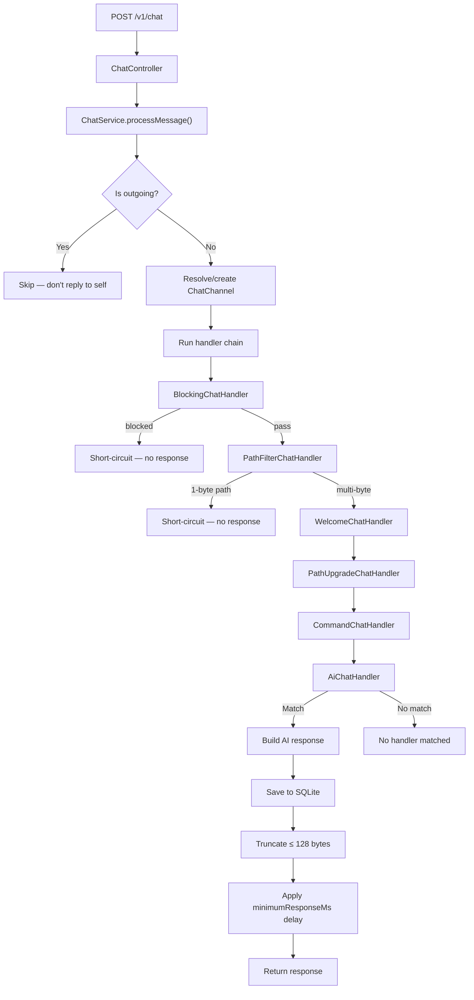

# ncbot — Agent Guide

**AI chat bot for [Meshcore](https://meshcore.io/)** — receives chat messages via HTTP, processes them through a chain of handlers, runs them through an OpenAI-compatible model, and returns short responses (≤ 128 UTF-8 bytes).

---

## TL;DR

| Item | Value |
|---|---|
| **What it does** | RemoteTerm (Python bot) forwards every chat message to `POST /v1/chat` → ncbot processes it → returns a response |
| **Tech stack** | Java 25 · Spring Boot 4.0.6 · Spring AI 2.0.0-M8 · Spring Data REST · SQLite · jte · Gradle |
| **Entry point** | `NcbotApplication.java` (root package) |
| **Config** | `src/main/resources/config/application.yml` or env vars prefixed `NCBOT_` |
| **Admin health** | `GET http://localhost:8080/admin/health` |
| **Data API** | `GET http://localhost:8080/api/*` (custom admin API) |
| **Docker image** | `jhuebert/ncbot:latest` |

---

## Prerequisites

- **JDK 25** (Eclipse Temurin recommended)
- **Gradle 8+** (shipwrecked via `gradlew`)
- **Docker & Compose** (for production / containerized dev)
- An **OpenAI-compatible API endpoint** (e.g. llama.cpp on port 11435)

---

## Building & Running

```bash
# Local development (hot-reload via jte dev mode)
./gradlew bootRun

# Full build (skips tests)
./gradlew build -x test

# Run tests
./gradlew test

# Docker (production)
# Builds the JAR locally first, then copies it into the Docker image (fast on QEMU)
./build.sh
```

**Docker volumes:** `./data` → `/data` inside container (persists `ncbot.db`).

---

## Project Structure

```
org.huebert.ncbot/
├── NcbotApplication.java          # @SpringBootApplication, main entry
│
├── config/                        # Configuration properties
│   ├── AiMode                     # AI mode enum (DISABLED, EACH, TAGGED)
│   ├── ChannelCapabilities        # Resolved channel capabilities from flat lists
│   └── NcbotProperties            # @ConfigurationProperties record
│
├── controller/                    # HTTP endpoints
│   ├── ChatController             # POST /v1/chat — public API
│   └── AdminController            # GET /admin/health — health check
│
├── service/                       # Business logic
│   ├── ChatService                # Core message processing, orchestrates handler chain
│   ├── MemoryService              # Scheduled AI memory synthesis
│   ├── TemplateService            # jte template rendering
│   └── WeatherService             # Open-Meteo weather API client
│
├── handler/                       # Request handlers (ordered chain)
│   ├── ChatHandler                # Interface — handlers implement this
│   ├── AiChatHandler              # Calls OpenAI-compatible model
│   ├── BlockingChatHandler        # User/path blocking (ORDER 200, runs first)
│   ├── CommandChatHandler         # Shortcut commands (help, ping, etc.)
│   ├── PathFilterChatHandler      # Blocks 1-byte paths from command/AI (ORDER 60)
│   ├── PathUpgradeChatHandler     # Notifies users to upgrade path hash
│   ├── WelcomeChatHandler         # Greets new participants
│   └── command/                   # Individual command handlers
│       ├── ChannelsChatHandler
│       ├── HelpChatHandler
│       ├── PathChatHandler
│       ├── PingChatHandler
│       ├── TestChatHandler
│       └── UsersChatHandler
│
├── tool/                          # AI tools exposed to the model
│   ├── ChatTool.java
│   └── WeatherTool.java
│
├── entity/                        # JPA entities
│   ├── ChatChannel.java
│   ├── ChatMemory.java
│   ├── ChatMessage.java
│   └── ChatParticipant.java
│
├── repository/                    # JPA repositories
│   ├── ChatChannelRepository
│   ├── ChatMemory2Repository
│   ├── ChatMessageRepository
│   └── ChatParticipantRepository
├── controller/dto/                # API response DTOs
│   ├── ChannelDto
│   ├── MessageDto
│   ├── MessagesResponse
│   ├── MemoryDto
│   ├── MemoryCreateRequest
│   ├── MemoryUpdateRequest
│   ├── ParticipantDto
│   └── PageResponse
├── dto/                           # Request/response DTOs
│   ├── ChatRequest
│   ├── ChatResponse
│   ├── WeatherApiResponse
│   ├── WeatherCode
│   ├── WeatherCurrent
│   ├── WeatherCurrentUnits
│   └── WeatherToolResponse
└── util/                          # Utility classes
    ├── Delay
    ├── Pair
    └── Truncate
```

**Resources:** `src/main/resources/config/` (config) · `src/main/jte/` (jte templates)

---

## Architecture

### Message Flow



The handler chain is ordered by `getOrder()` on the `ChatHandler` interface — **lower values run first**. `AiChatHandler` is the last resort.

### Handler Chain Ordering

```mermaid
flowchart LR
    BH["BlockingChatHandler"] -->|getOrder: 200 (first)| PFC["PathFilterChatHandler"]
    PFC -->|getOrder: 60| PU["PathUpgradeChatHandler"]
    PU -->|getOrder: 75| WH["WelcomeChatHandler"]
    WH -->|getOrder: 100| CMCH["CommandChatHandler"]
    CMCH -->|getOrder: 50| AIH["AiChatHandler"]
    AIH -->|getOrder: -100| Last["Last resort — fallback to AI"]
```

**Lower `getOrder()` values run first.** First matching handler short-circuits the chain.

### Short-Circuit Mechanism

Handlers return `Optional.of("")` (empty string) to signal a block. `ChatService.generateResponse()` detects this and returns `EMPTY_RESPONSE` without saving.

### Key Concepts

#### Channel Configuration (Flat Lists)

Channels are defined via comma-separated lists in config. Each list contains channel names that enable a specific capability:

```yaml
ncbot:
  channels-welcome: "#ncbot, #general"
  channels-command: "#ncbot, #general"
  channels-path-upgrade: "#ncbot"
  channels-ai-each: "#ncbot, #general"
  channels-ai-tagged: "#quiet"
  channels-ai-disabled: "#noai"
```

**AI Mode Precedence:**
1. `ai-disabled` wins over `ai-tagged` and `ai-each` (explicit disable)
2. `ai-each` wins over `ai-tagged` (respond to everything beats respond-only-on-tag)
3. Default is `DISABLED` if channel appears in no AI list

**Other flags** (`welcome`, `command`, `path-upgrade`) are independent boolean flags — presence in the list means `true`, absence means `false`.

#### Malicious User Blocking

Users and paths can be blocked via regex patterns:

```yaml
ncbot:
  block-user-patterns: ".*(bot|spam|scam).*"
  allow-user-patterns: "admin.*"
  block-path-patterns: ".*malicious.*"
  allow-path-patterns: "internal.*"
```

**Precedence:** allow always beats block. If a user/path matches an allow pattern, they are allowed regardless of block patterns.

#### Path Filtering

Messages arriving on 1-byte paths (`pathBytesPerHop == 1`) are blocked from reaching command and AI handlers. Welcome and path-upgrade notifications still work.

#### Memory System
- `MemoryService` runs on a schedule (`NCBOT_MEMORY_UPDATE_PERIOD`, default 30m)
- Reads message partitions (`NCBOT_MEMORY_PARTITION_SIZE`, default 100)
- Sends them to AI for key-value memory synthesis
- Memories are included in every AI chat prompt as `CHAT_MEMORY`
- Memory keys use dot-separated namespaces: `user.*`, `channel.*`, `bot.*`

#### AI Prompt Assembly
Templates in `jte/prompts/` assemble context blocks:
- `chat.jte` — main prompt (memories + messages + request)
- `condense.jte` — compressing oversized responses
- `memory.jte` — memory synthesis
- `welcome.jte` — welcome messages

#### Tools Available to AI
- `getCurrentWeather(lat, lon)` — Open-Meteo API (temperature, wind, humidity, conditions)
- `getKnownChannels()` — list all channels the bot has seen
- `searchUsers(name)` — search users by substring

---

## Configuration

### Environment Variables

All config can be overridden via environment variables with the `NCBOT_` prefix:

| Variable | Default | Description |
|---|---|---|
| `NCBOT_API_KEY` | `default-key` | OpenAI-compatible API key |
| `NCBOT_OPENAI_BASE_URL` | `http://192.168.1.240:11435/v1` | API endpoint URL |
| `NCBOT_MODEL` | `ncbot` | Model identifier |
| `NCBOT_TEMPERATURE` | `0.7` | Sampling temperature |
| `NCBOT_RESPONSE_DELAY_SECONDS` | `1.5` | Minimum response delay |
| `NCBOT_MAX_REPLY_BYTES` | `128` | Maximum response length |
| `NCBOT_HISTORY_LIMIT` | `20` | Conversation history entries |
| `NCBOT_ALLOW_DMS` | `false` | Respond to DMs? |
| `NCBOT_MEMORY_UPDATE_PERIOD` | `30m` | Memory synthesis interval |
| `NCBOT_MEMORY_PARTITION_SIZE` | `100` | Messages per memory batch |
| `NCBOT_MINIMUM_RESPONSE_MS` | `3000` | Response delay padding |
| `NCBOT_SYSTEM_PROMPT` | *(in application.yml)* | Custom system prompt |
| `NCBOT_CHANNELS_WELCOME` | *(empty)* | Comma-separated channel names for welcome |
| `NCBOT_CHANNELS_COMMAND` | *(empty)* | Comma-separated channel names for commands |
| `NCBOT_CHANNELS_PATH_UPGRADE` | *(empty)* | Comma-separated channel names for path-upgrade |
| `NCBOT_CHANNELS_AI_EACH` | *(empty)* | Comma-separated channel names for AI (each) |
| `NCBOT_CHANNELS_AI_TAGGED` | *(empty)* | Comma-separated channel names for AI (tagged) |
| `NCBOT_CHANNELS_AI_DISABLED` | *(empty)* | Comma-separated channel names for AI (disabled) |
| `NCBOT_ALLOWED_DMS` | *(empty)* | Comma-separated hex keys for allowed DMs |
| `NCBOT_BLOCK_USER_PATTERNS` | *(empty)* | Comma-separated regex patterns to block users |
| `NCBOT_ALLOW_USER_PATTERNS` | *(empty)* | Comma-separated regex patterns to allow users |
| `NCBOT_BLOCK_PATH_PATTERNS` | *(empty)* | Comma-separated regex patterns to block paths |
| `NCBOT_ALLOW_PATH_PATTERNS` | *(empty)* | Comma-separated regex patterns to allow paths |

### Config File

Primary config: `src/main/resources/config/application.yml`. Contains system prompts, channel definitions, and all other settings.

**Example config:**

```yaml
ncbot:
  name: ncbot
  channels-welcome: "#ncbot, #general"
  channels-command: "#ncbot, #general"
  channels-path-upgrade: "#ncbot"
  channels-ai-each: "#ncbot, #general"
  channels-ai-tagged: "#quiet"
  channels-ai-disabled: "#noai"
  allowed-dms: "hexkey1, hexkey2"
  block-user-patterns: ".*(bot|spam|scam).*"
  allow-user-patterns: "admin.*"
  # ... system-prompt, condense-prompt, memory-prompt, etc.
```

**DMs** are controlled separately via `ncbot.allowed-dms` (comma-separated hex keys). DMs always have `ai: EACH`, `welcome: true`, and `command: true` if the sender key is in the allowed list.

### Admin API

Custom endpoints at `/api/*` provide read access to all entities plus full CRUD on memories. Global and channel-specific memory operations use **separate, distinct routes** (no optional channel parameters).

All read endpoints support pagination via `?page=1&size=25` (1-indexed page, default 25 per page). Responses use the generic `PageResponse<T>` wrapper:

```json
{
  "content": [...],
  "totalPages": 5,
  "currentPage": 2,
  "totalElements": 123
}
```

| Path | Method | Description |
|---|---|---|
| `/api/channels` | GET | All channels (filter: `?dm=true\|false`) — `PageResponse<ChannelDto>` |
| `/api/channels/{channelId}/messages` | GET | Messages for a channel (`?page`, `?size`, `?before=ISO-instant`, `?after=ISO-instant`, `?sortDirection=ASC\|DESC`) — `MessagesResponse` |
| `/api/channels/{channelId}/memory` | GET | Channel-specific memories — `PageResponse<MemoryDto>` |
| `/api/channels/{channelId}/memory` | POST | Create channel memory (body: `{key, value}`) — `MemoryDto` |
| `/api/channels/{channelId}/memory/{id}` | PUT | Update channel memory (body: `{key, value}`) — validates channel match — `MemoryDto` |
| `/api/channels/{channelId}/memory/{id}` | DELETE | Delete channel memory — validates channel match — `204 No Content` |
| `/api/channels/{channelId}/memory/{id}/promote` | POST | Promote channel memory to global (deletes source) — `MemoryDto` |
| `/api/channels/{channelId}/participants` | GET | Participants for a channel — `PageResponse<ParticipantDto>` |
| `/api/memory` | GET | Global memories — `PageResponse<MemoryDto>` |
| `/api/memory` | POST | Create global memory (body: `{key, value}`) — `MemoryDto` |
| `/api/memory/{id}` | PUT | Update global memory (body: `{key, value}`) — validates global scope — `MemoryDto` |
| `/api/memory/{id}` | DELETE | Delete global memory — validates global scope — `204 No Content` |
| `/api/participants` | GET | All participants with last seen — `PageResponse<ParticipantDto>` |

**Validation rules:**
- Channel memory endpoints (`/api/channels/{channelId}/memory/*`) reject requests where the memory's `chatChannelId` doesn't match the path parameter
- Global memory endpoints (`/api/memory/*`) reject requests where the memory has a non-null `chatChannelId`
- Promote endpoint validates source belongs to the specified channel, then copies to global and deletes the source

**Response DTOs** (in `controller.dto` package):

| DTO | Fields |
|---|---|
| `ChannelDto` | `id`, `channelKey`, `channelName`, `isDm` |
| `MessageDto` | `id`, `senderName`, `content`, `createdAt` |
| `MessagesResponse` | `channelId`, `channelName`, `messages[]`, `totalPages`, `currentPage`, `totalElements` |
| `MemoryDto` | `id`, `channelId`, `key`, `value` |
| `ParticipantDto` | `name`, `lastSeen` |
| `PageResponse<T>` | `content[]`, `totalPages`, `currentPage`, `totalElements` |

---

## Development Guidelines

### Code Style & Conventions

- **Records & Lombok** — DTOs and config properties use Java records; entities use Lombok annotations (`@Slf4j`, builders)
- **No boilerplate** — Prefer records over classes for data carriers; use Lombok for boilerplate reduction
- **Handler interface** — All request handlers implement `ChatHandler` with `getOrder()` for chain ordering
- **Component registration** — All handlers, tools, and services are Spring `@Component` beans (auto-discovered)
- **SQLite** — JPA `ddl-auto: update`, dialect is `SQLiteDialect` via `hibernate-community-dialects`
- All conditional/loops/etc should use braces

### Prompt Engineering

- All AI prompts live as jte templates in `src/main/jte/prompts/`
- Prompts use structured sections: `# ROLE`, `# OBJECTIVE`, `# INPUT`, `# OUTPUT RULES`, `# DATA SCHEMA`
- The system prompt enforces strict constraints: ≤ 128 bytes, `@[username]` mentions, no self-intro
- Condensing is enabled by default — if AI response exceeds 128 bytes, a second AI call compresses it

### jte Templates

- Templates in `src/main/jte/prompts/command/` define per-command prompt overrides
- jte compiles at build time (`gg.jte.gradle` plugin); set `gg.jte.development-mode: true` for live reload

### Testing

- Uses Spring Boot Test with JUnit Platform
- Test dependencies: `spring-boot-starter-*-test` for each module (actuator, data-jpa, restclient, webmvc)
- Run with `./gradlew test`
- Main test class: `NcbotApplicationTests.java`

### Documentation

- Update all documentation after making code changes so that the documentation stays up to date.
- Documentation
  - `AGENTS.md` (this file)
  - `README.md`
  - `openapi.yml`

---

## Extending the Bot

### Adding a New Command

1. Create a class in `handler/command/` implementing `CommandChatHandler`
2. Define the command strings in a `Set<String>` constant
3. Check `ChannelCapabilities.command()` before responding
4. Add a jte prompt template in `jte/prompts/command/`

### Adding a New AI Tool

1. Create a `@Component` class in the `tool/` package
2. Use Spring AI's `@Tool` annotation to expose methods
3. Add to `AiChatHandler`'s `ChatClient.defaultTools()`

### Adding a New Handler

1. Implement the `ChatHandler` interface in the `handler/` package
2. Set `getOrder()` to control execution position
3. Register as a Spring `@Component` — auto-injected into `ChatService`

---

## Security Notes

- **API keys** are passed via environment variables or config — never commit secrets to version control
- **SQLite database** is stored locally (`./data/ncbot.db`) — restrict file permissions in production
- **Spring Data REST** has no authentication — do not expose `/api/data` to untrusted networks
- **OpenAI endpoint** — verify TLS on `NCBOT_OPENAI_BASE_URL` in production

---

## Troubleshooting

| Symptom | Likely Cause | Fix |
|---|---|---|
| No responses | Channel not in any AI list (`channels-ai-each`, `channels-ai-tagged`, `channels-ai-disabled`) | Check channel config in flat lists |
| DMs not working | Sender key not in allowed list | Add to `ncbot.allowed-dms` |
| Responses too long | Condensing disabled or limit too high | Enable condensing or reduce `NCBOT_MAX_REPLY_BYTES` |
| Slow responses | High `NCBOT_MINIMUM_RESPONSE_MS` or slow model | Reduce delay or use faster model |
| Template errors | jte compile failure | Check `src/main/jte/` syntax; run `./gradlew build` |
| DB issues | Corrupted SQLite or migration error | Delete `./data/ncbot.db` and restart (data resets) |
| User blocked unexpectedly | Regex pattern in `block-user-patterns` matches | Check patterns; use `allow-user-patterns` to whitelist |
| 1-byte path messages not responding | `PathFilterChatHandler` blocks them by design | This is intentional — welcome/upgrade still work |

**Check logs:**
```bash
docker compose logs ncbot
# or locally:
./gradlew bootRun
```
