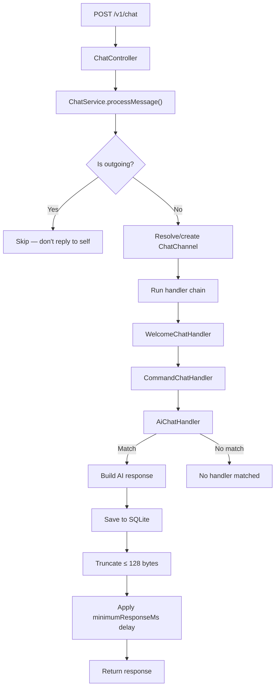
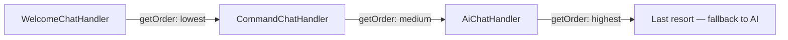

# ncbot — Agent Guide

**AI chat bot for [Meshcore](https://meshcore.net/)** — receives chat messages via HTTP, processes them through a chain of handlers, runs them through an OpenAI-compatible model, and returns short responses (≤ 128 UTF-8 bytes).

---

## TL;DR

| Item | Value |
|---|---|
| **What it does** | RemoteTerm (Python bot) forwards every chat message to `POST /v1/chat` → ncbot processes it → returns a response |
| **Tech stack** | Java 25 · Spring Boot 4.0.6 · Spring AI 2.0.0-M5 · SQLite · jte · Gradle |
| **Entry point** | `NcbotApplication.java` (root package) |
| **Config** | `src/main/resources/application.yaml` or env vars prefixed `NCBOT_` |
| **Admin UI** | `http://localhost:8080/admin` |
| **Docker image** | `jhuebert/ncbot:latest` |

---

## Prerequisites

- **JDK 25** (Eclipse Temurin recommended)
- **Gradle 8+** (shipwrecked via `gradlew`)
- **Docker & Compose** (for production / containerized dev)
- An **OpenAI-compatible API endpoint** (e.g. llama.cpp on port 11435)

---

## Building & Running

```bash
# Local development (hot-reload via jte dev mode)
./gradlew bootRun

# Full build (skips tests)
./gradlew build -x test

# Run tests
./gradlew test

# Docker (production)
# Builds the JAR locally first, then copies it into the Docker image (fast on QEMU)
./build.sh
```

**Docker volumes:** `./data` → `/data` inside container (persists `ncbot.db`).

---

## Project Structure

```
org.huebert.ncbot/
├── NcbotApplication.java          # @SpringBootApplication, main entry
│
├── config/                        # Configuration properties
├── controller/                    # HTTP endpoints
│   ├── ChatController             # POST /v1/chat — public API
│   ├── AdminController            # Admin UI routes (/admin/*)
│   └── AdminApiController         # JSON API endpoints (/api/admin/*)
│
├── service/                       # Business logic
│   ├── ChatService                # Core message processing, orchestrates handler chain
│   ├── MemoryService              # Scheduled AI memory synthesis
│   ├── TemplateService            # jte template rendering
│   └── WeatherService             # Open-Meteo weather API client
│
├── handler/                       # Request handlers (ordered chain)
│   ├── ChatHandler                # Interface — handlers implement this
│   ├── AiChatHandler              # Calls OpenAI-compatible model
│   ├── CommandChatHandler         # Shortcut commands (help, ping, etc.)
│   ├── PathUpgradeChatHandler     # Notifies users to upgrade path hash
│   ├── WelcomeChatHandler         # Greets new participants
│   └── command/                   # Individual command handlers
│       ├── ChannelsChatHandler
│       ├── HelpChatHandler
│       ├── PathChatHandler
│       ├── PingChatHandler
│       ├── TestChatHandler
│       └── UsersChatHandler
│
├── tool/                          # AI tools exposed to the model
│   ├── ChatTool.java
│   └── WeatherTool.java
│
├── entity/                        # JPA entities
│   ├── ChatChannel.java
│   ├── ChatMemory.java
│   ├── ChatMessage.java
│   └── ChatParticipant.java
│
├── repository/                    # JPA repositories
│   ├── ChatChannelRepository
│   ├── ChatMemory2Repository
│   ├── ChatMessageRepository
│   └── ChatParticipantRepository
├── dto/                           # Request/response DTOs
│   ├── ChatRequest
│   ├── ChatResponse
│   ├── WeatherApiResponse
│   ├── WeatherCode
│   ├── WeatherCurrent
│   ├── WeatherCurrentUnits
│   └── WeatherToolResponse
└── util/                          # Utility classes
    ├── Delay
    ├── Pair
    └── Truncate
```

**Resources:** `src/main/resources/` (config, static assets) · `src/main/jte/` (jte templates)

---

## Architecture

### Message Flow



The handler chain is ordered by `getOrder()` on the `ChatHandler` interface — **lower values run first**. `AiChatHandler` is the last resort.

### Handler Chain Ordering



**Lower `getOrder()` values run first.** First matching handler short-circuits the chain.

### Key Concepts

#### Channel Configuration
Channels are defined in config under `ncbot.channels`. Each has an `ai` mode and flags:

**AI Mode** (`ai`)
- `DISABLED` — no AI responses (default when omitted)
- `EACH` — respond to every message
- `TAGGED` — respond only when `@ncbot` is mentioned

**Other flags:**
- `welcome` — greet new participants
- `command` — enable command shortcuts
- `path-upgrade` — notify users to upgrade path hash

DMs are controlled separately via `ncbot.allowed-dms` (set of hex keys).

#### Memory System
- `MemoryService` runs on a schedule (`NCBOT_MEMORY_UPDATE_PERIOD`, default 30m)
- Reads message partitions (`NCBOT_MEMORY_PARTITION_SIZE`, default 100)
- Sends them to AI for key-value memory synthesis
- Memories are included in every AI chat prompt as `CHAT_MEMORY`
- Memory keys use dot-separated namespaces: `user.*`, `channel.*`, `bot.*`

#### AI Prompt Assembly
Templates in `jte/prompts/` assemble context blocks:
- `chat.jte` — main prompt (memories + messages + request)
- `condense.jte` — compressing oversized responses
- `memory.jte` — memory synthesis
- `welcome.jte` — welcome messages

#### Tools Available to AI
- `getCurrentWeather(lat, lon)` — Open-Meteo API (temperature, wind, humidity, conditions)
- `getKnownChannels()` — list all channels the bot has seen
- `searchUsers(name)` — search users by substring

---

## Configuration

### Environment Variables

All config can be overridden via environment variables with the `NCBOT_` prefix:

| Variable | Default | Description |
|---|---|---|
| `NCBOT_API_KEY` | `default-key` | OpenAI-compatible API key |
| `NCBOT_OPENAI_BASE_URL` | `http://192.168.1.240:11435/v1` | API endpoint URL |
| `NCBOT_MODEL` | `ncbot` | Model identifier |
| `NCBOT_TEMPERATURE` | `0.7` | Sampling temperature |
| `NCBOT_RESPONSE_DELAY_SECONDS` | `1.5` | Minimum response delay |
| `NCBOT_MAX_REPLY_BYTES` | `128` | Maximum response length |
| `NCBOT_HISTORY_LIMIT` | `20` | Conversation history entries |
| `NCBOT_ALLOW_DMS` | `false` | Respond to DMs? |
| `NCBOT_MEMORY_UPDATE_PERIOD` | `30m` | Memory synthesis interval |
| `NCBOT_MEMORY_PARTITION_SIZE` | `100` | Messages per memory batch |
| `NCBOT_MINIMUM_RESPONSE_MS` | `3000` | Response delay padding |
| `NCBOT_SYSTEM_PROMPT` | *(in application.yaml)* | Custom system prompt |

### Config File

Primary config: `src/main/resources/application.yaml`. Contains system prompts, channel definitions, and all other settings.

**Example channel config:**

```yaml
ncbot:
  channels:
    - name: "#ncbot"
      ai: EACH              # respond to every message
      welcome: true
      path-upgrade: true
      command: true
    - name: "#quiet"
      ai: TAGGED            # only respond when @ncbot is mentioned
      command: true
    - name: "#noai"
      ai: DISABLED          # no AI (or omit ai property entirely)
      welcome: true
```

**DMs** are controlled separately via `ncbot.allowed-dms` (set of hex keys). DMs always have `ai: EACH`, `welcome: true`, and `command: true`.

---

## Development Guidelines

### Code Style & Conventions

- **Records & Lombok** — DTOs and config properties use Java records; entities use Lombok annotations (`@Slf4j`, builders)
- **No boilerplate** — Prefer records over classes for data carriers; use Lombok for boilerplate reduction
- **Handler interface** — All request handlers implement `ChatHandler` with `getOrder()` for chain ordering
- **Component registration** — All handlers, tools, and services are Spring `@Component` beans (auto-discovered)
- **SQLite** — JPA `ddl-auto: update`, dialect is `SQLiteDialect` via `hibernate-community-dialects`

### Prompt Engineering

- All AI prompts live as jte templates in `src/main/jte/prompts/`
- Prompts use structured sections: `# ROLE`, `# OBJECTIVE`, `# INPUT`, `# OUTPUT RULES`, `# DATA SCHEMA`
- The system prompt enforces strict constraints: ≤ 128 bytes, `@[username]` mentions, no self-intro
- Condensing is enabled by default — if AI response exceeds 128 bytes, a second AI call compresses it

### jte Templates

- Templates in `src/main/jte/admin/` build the admin UI (shared via `_layout.jte`)
- Templates in `src/main/jte/prompts/command/` define per-command prompt overrides
- jte compiles at build time (`gg.jte.gradle` plugin); set `gg.jte.development-mode: true` for live reload

### Testing

- Uses Spring Boot Test with JUnit Platform
- Test dependencies: `spring-boot-starter-*-test` for each module (actuator, data-jpa, restclient, webmvc)
- Run with `./gradlew test`
- Main test class: `NcbotApplicationTests.java`

---

## Extending the Bot

### Adding a New Command

1. Create a class in `handler/command/` implementing `ChatHandler`
2. Set `getOrder()` higher than `AiChatHandler`, lower than `WelcomeChatHandler`
3. Add a jte prompt template in `jte/prompts/command/`
4. Register the command in `CommandChatHandler`'s command map

### Adding a New AI Tool

1. Create a `@Component` class in the `tool/` package
2. Use Spring AI's `@Tool` annotation to expose methods
3. Add to `AiChatHandler`'s `ChatClient.defaultTools()`

### Adding a New Handler

1. Implement the `ChatHandler` interface in the `handler/` package
2. Set `getOrder()` to control execution position
3. Register as a Spring `@Component` — auto-injected into `ChatService`

### Adding Admin UI Pages

1. Add a route method to `AdminController`
2. Create a jte template in `jte/admin/`
3. Use `_layout.jte` as the base layout (partial includes for headers/footers)
4. HTMX can be used for AJAX-driven partial updates

---

## Security Notes

- **API keys** are passed via environment variables or config — never commit secrets to version control
- **SQLite database** is stored locally (`./data/ncbot.db`) — restrict file permissions in production
- **Admin UI** has no authentication — do not expose `/admin` to untrusted networks
- **OpenAI endpoint** — verify TLS on `NCBOT_OPENAI_BASE_URL` in production

---

## Troubleshooting

| Symptom | Likely Cause | Fix |
|---|---|---|
| No responses | Channel config missing `ai: EACH`/`TAGGED` or name mismatch | Check `ncbot.channels` in config |
| DMs not working | Sender key not in allowed list | Add to `ncbot.allowed-dms` |
| Responses too long | Condensing disabled or limit too high | Enable condensing or reduce `NCBOT_MAX_REPLY_BYTES` |
| Slow responses | High `NCBOT_MINIMUM_RESPONSE_MS` or slow model | Reduce delay or use faster model |
| Template errors | jte compile failure | Check `src/main/jte/` syntax; run `./gradlew build` |
| DB issues | Corrupted SQLite or migration error | Delete `./data/ncbot.db` and restart (data resets) |

**Check logs:**
```bash
docker compose logs ncbot
# or locally:
./gradlew bootRun
```
