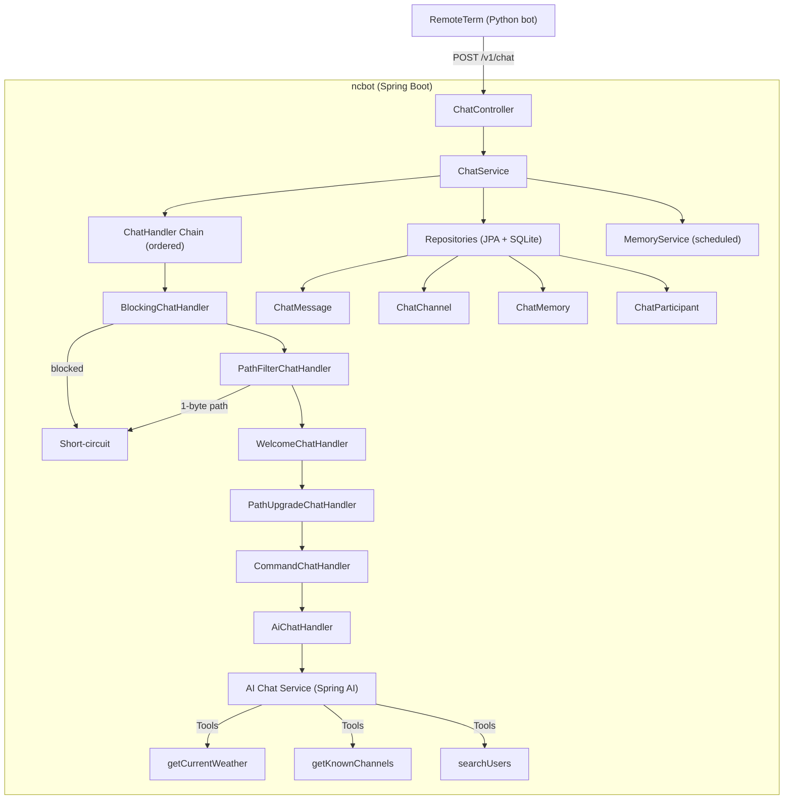

# ncbot

AI chat provider for [Meshcore](https://meshcore.net/), invoked by the RemoteTerm application for every message sent to a chat channel or DM thread. It persists messages to SQLite, runs them through an OpenAI-compatible AI model, and returns short responses (≤ 128 UTF-8 bytes) that RemoteTerm delivers back to the mesh network.

## Architecture



**Handler chain** — lower `getOrder()` runs first; `AiChatHandler` is the last resort.

## Prerequisites

- **Docker** — for containerized deployment
- **OpenAI-compatible AI endpoint** — e.g. [Ollama](https://ollama.com/), llama.cpp, or any OpenAI-compatible API
- **JDK 25** — for local development

## Quick Start

### 1. Build and run with Docker Compose

```bash
# Edit docker-compose.yml with your AI endpoint settings
vim docker-compose.yml

# Build the image
docker compose build

# Start
docker compose up -d
```

### 2. Configure RemoteTerm

Copy `bot.py` to your RemoteTerm bot directory and set the environment variable:

```bash
export NCBOT_URL=http://localhost:8080/v1/chat
```

RemoteTerm will invoke `bot(**kwargs)` for every message. The script forwards it to ncbot and returns the AI response.

### 3. Access the Admin API

Browse entities via the custom admin API at `http://localhost:8080/api/channels`.

## Configuration

All configuration is via environment variables or `application.yml`:

| Variable | Default | Description |
|----------|---------|-------------|
| `NCBOT_API_KEY` | `default-key` | API key for the OpenAI-compatible endpoint |
| `NCBOT_OPENAI_BASE_URL` | *(from application.yml)* | Base URL for the AI server |
| `NCBOT_MODEL` | `ncbot` | Model name/identifier |
| `NCBOT_MINIMUM_RESPONSE_MS` | `3000` | Minimum response delay in milliseconds (0 to disable) |
| `NCBOT_MAX_REPLY_BYTES` | `128` | Max UTF-8 bytes per reply message |
| `NCBOT_CONDENSE` | `true` | Enable AI-based response condensing when over byte limit |
| `NCBOT_MEMORY_UPDATE_PERIOD` | `30m` | Scheduled interval for AI memory synthesis |
| `NCBOT_MEMORY_PARTITION_SIZE` | `100` | Number of messages per memory partition |
| `NCBOT_WELCOME_CONTENT` | *(empty)* | Welcome message appended for new participants |

### Channel Configuration (Flat Lists)

Channels are configured via comma-separated lists — one per capability. Each list contains channel names that enable that capability:

```yaml
ncbot:
  channels-welcome: "#ncbot, #general"
  channels-command: "#ncbot, #general"
  channels-path-upgrade: "#ncbot"
  channels-ai-each: "#ncbot, #general"
  channels-ai-tagged: "#quiet"
  channels-ai-disabled: "#noai"
```

**AI Mode Precedence:**
1. `ai-disabled` wins over `ai-tagged` and `ai-each` (explicit disable)
2. `ai-each` wins over `ai-tagged` (respond to everything beats respond-only-on-tag)
3. Default is `DISABLED` if channel appears in no AI list

**Other flags** (`welcome`, `command`, `path-upgrade`) are independent boolean flags — presence in the list means `true`, absence means `false`.

**Environment variable example:**
```bash
NCBOT_CHANNELS_AI_EACH="#ncbot, #general"
NCBOT_CHANNELS_AI_TAGGED="#quiet"
NCBOT_CHANNELS_AI_DISABLED="#noai"
```

### Malicious User Blocking

```yaml
ncbot:
  block-user-patterns: ".*(bot|spam|scam).*"
  allow-user-patterns: "admin.*"
  block-path-patterns: ".*malicious.*"
  allow-path-patterns: "internal.*"
```

**Precedence:** allow always beats block. If a user/path matches an allow pattern, they are allowed regardless of block patterns.

### DM Access Control

DMs are controlled via a comma-separated list of allowed sender keys:

```yaml
ncbot:
  allowed-dms: "hex-key-1, hex-key-2"
```

Leave empty or unset to block all DMs. DMs always have `ai: EACH`, `welcome: true`, and `command: true`.

## RemoteTerm Setup

### Bot Script

The `bot.py` file is the RemoteTerm integration script. It:

1. Receives kwargs from RemoteTerm's bot system
2. POSTs to ncbot's `/v1/chat` endpoint
3. Returns the response (list of strings, or None)

Key behaviors:
- **No reply to own messages** — skips messages where `is_outgoing` is true
- **9-second timeout** — RemoteTerm allows 10 seconds total, leaving 1s margin
- **Graceful failure** — returns `None` on any error (bot silently fails)
- **No dependencies** — uses only Python standard library

### Bot Kwargs

RemoteTerm passes these kwargs:

| Parameter | Description |
|-----------|-------------|
| `sender_name` | Display name of sender (nullable) |
| `sender_key` | Hex public key (nullable for channels) |
| `message_text` | The message content |
| `is_dm` | True for DMs, false for channels |
| `channel_key` | Hex channel key (nullable for DMs) |
| `channel_name` | Channel name with hash (nullable for DMs) |
| `sender_timestamp` | Unix seconds (nullable) |
| `path` | Hex-encoded routing path (nullable) |
| `is_outgoing` | Whether this is our own outgoing message |
| `path_bytes_per_hop` | 1, 2, or 3 (nullable) |

## AI Features

### Memory System

ncbot maintains long-term memory per channel using AI-generated key-value pairs. A scheduled task periodically synthesizes conversation history into dense factual records (e.g., `user.john.pref.color=blue`). The memory is included in AI prompts to provide context across sessions.

- **Condensing**: When an AI response exceeds the byte limit, a second AI call condenses it to fit
- **Partitions**: Memory updates process messages in configurable batches
- **Storage**: Memories are stored in the `chat_memory` table, scoped to each channel

### Tools

The AI model has access to these tools:

| Tool | Description |
|------|-------------|
| `getCurrentWeather` | Get current weather by latitude/longitude (via Open-Meteo). Returns temperature (°F), wind speed (mph), wind direction (°), humidity (%), and conditions. |
| `getKnownChannels` | List all known Meshcore channels the bot has seen |
| `searchUsers` | Search for users by name substring |

## Admin API

Custom endpoints at `/api/*` provide read access to all entities plus full CRUD on memories. Global and channel-specific memory operations use **separate, distinct routes** (no optional channel parameters).

All read endpoints support pagination via `?page=1&size=25` (1-indexed page, default 25 per page). Responses use the generic `PageResponse<T>` wrapper:

```json
{
  "content": [...],
  "totalPages": 5,
  "currentPage": 2,
  "totalElements": 123
}
```

| Path | Method | Description |
|------|--------|-------------|
| `/api/channels` | GET | All channels (filter: `?dm=true\|false`) — `PageResponse<ChannelDto>` |
| `/api/channels/{channelId}/messages` | GET | Messages (`?page`, `?size`, `?before=ISO-instant`, `?after=ISO-instant`, `?sortDirection=ASC\|DESC`) — `MessagesResponse` |
| `/api/channels/{channelId}/memory` | GET | Channel-specific memories — `PageResponse<MemoryDto>` |
| `/api/channels/{channelId}/memory` | POST | Create channel memory (body: `{key, value}`) — `MemoryDto` |
| `/api/channels/{channelId}/memory/{id}` | PUT | Update channel memory (body: `{key, value}`) — validates channel match — `MemoryDto` |
| `/api/channels/{channelId}/memory/{id}` | DELETE | Delete channel memory — validates channel match — `204 No Content` |
| `/api/channels/{channelId}/memory/{id}/promote` | POST | Promote channel memory to global (deletes source) — `MemoryDto` |
| `/api/channels/{channelId}/participants` | GET | Participants for a channel — `PageResponse<ParticipantDto>` |
| `/api/memory` | GET | Global memories — `PageResponse<MemoryDto>` |
| `/api/memory` | POST | Create global memory (body: `{key, value}`) — `MemoryDto` |
| `/api/memory/{id}` | PUT | Update global memory (body: `{key, value}`) — validates global scope — `MemoryDto` |
| `/api/memory/{id}` | DELETE | Delete global memory — validates global scope — `204 No Content` |
| `/api/participants` | GET | All participants with last seen — `PageResponse<ParticipantDto>` |

**Validation rules:**
- Channel memory endpoints (`/api/channels/{channelId}/memory/*`) reject requests where the memory's `chatChannelId` doesn't match the path parameter
- Global memory endpoints (`/api/memory/*`) reject requests where the memory has a non-null `chatChannelId`
- Promote endpoint validates source belongs to the specified channel, then copies to global and deletes the source

## Commands

Commands are per-channel (controlled by the `channels-command` list). They are matched case-insensitively and use single-letter aliases:

| Command | Alias | Response |
|---------|-------|----------|
| `help` | `h` | List of available commands |
| `ping` | `p` | "pong" |
| `path` | `m` | Hex-encoded routing path decoded into hops |
| `test` | `t` | Connection info (time, path) |
| `users` | `u` | List of known users |
| `channels` | `c` | List of known channels |

## Database

SQLite database file lives at `/data/ncbot.db` inside the container. The `docker-compose.yml` mounts `./data:/data` by default.

- **Persisting data:** Keep the volume mount in docker-compose.yml
- **Ephemeral storage:** Remove the volume mount
- **Upgrading:** `docker compose pull && docker compose up -d` — DB persists across upgrades

## Troubleshooting

### AI Connection Failed

- Verify `NCBOT_OPENAI_BASE_URL` points to a running AI server
- Check that `NCBOT_API_KEY` is correct (if required by your server)
- Test with: `curl -v $NCBOT_OPENAI_BASE_URL/v1/models`

### Bot Not Responding

- Check ncbot logs: `docker compose logs ncbot`
- Verify channel configuration — the channel must appear in `channels-ai-each` or `channels-ai-tagged`
- For DMs, check that the sender key is in `ncbot.allowed-dms`
- Look for filter log messages: "skipping channel" or "skipping DM"

### Responses Too Long

- Reduce `NCBOT_MAX_REPLY_BYTES` (default 128)
- The system prompt instructs the AI to keep responses under the limit
- Condensing is enabled by default — a second AI call will compress oversized responses

### Slow Responses

- Reduce `NCBOT_MINIMUM_RESPONSE_MS` (default 3000)
- Check AI model inference speed
- Consider a faster model or hardware acceleration

### User Blocked Unexpectedly

- Check `block-user-patterns` — the user name may match a regex
- Use `allow-user-patterns` to whitelist specific users
- Check logs for "blocked" messages

### 1-Byte Path Messages Not Responding

- This is intentional — `PathFilterChatHandler` blocks 1-byte paths from reaching command/AI handlers
- Welcome and path-upgrade notifications still work for these paths

## Upgrading

```bash
docker compose pull
docker compose up -d
```

## Development

```bash
# Run locally (requires JDK 25)
./gradlew bootRun

# Build
./gradlew build

# Run tests
./gradlew test
```

## License

See LICENSE file
